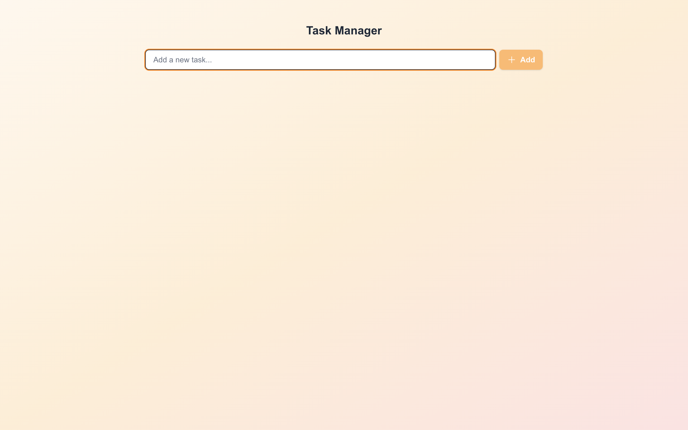

# ✨ Modern Task Management Application

A sleek and modern task management application built with Next.js 14, featuring real-time updates, GraphQL integration, and a beautiful UI powered by Tailwind CSS.

## 🚀 Live Demo

[View Live Demo](https://task-management-rl4rw65nn-amantyagi22s-projects.vercel.app/) 
[Backend Repository](https://github.com/amantyagi22/task-management-server)

## ✨ Features

- **Task Management**
  - Create, edit, and delete tasks
  - Mark tasks as complete/incomplete
  - Real-time updates with React Query
  - Inline editing with optimistic updates

- **Modern Architecture**
  - Next.js 14 with App Router
  - Type-safe GraphQL with Codegen
  - TanStack Query for state management
  - Tailwind CSS for styling

- **Developer Experience**
  - TypeScript for type safety
  - GraphQL Code Generation
  - React Query DevTools
  - Hot Module Replacement

## 🛠️ Tech Stack

- **Frontend**: Next.js 14, React 19
- **State Management**: TanStack Query
- **API**: GraphQL with graphql-request
- **Styling**: Tailwind CSS
- **Icons**: Heroicons
- **Type Safety**: TypeScript, GraphQL Codegen

## 📸 Screenshots

